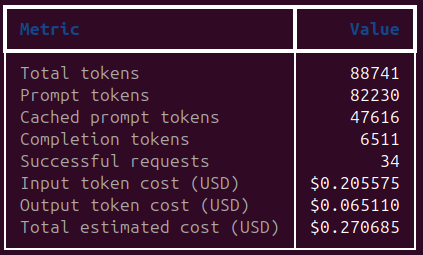

# AI-Agent-Stock-Prediction

## Executing the Code

There are two programs that are not yet integrated. From the root directory run:

```sh
(stocks) jglossner@jglossner:~/GitRepos/StockPrediction-AiAgent$ streamlit run src/UI/app.py
```
or
```sh
(stocks) jglossner@jglossner:~/GitRepos/StockPrediction-AiAgent$ python -m src.UI.scenario
```

Typical scenario prediction output


Typical cost to run the scenario prediction


## Installation
```sh
conda env create -f conda_env.yml
```


## Manual Installation (not recommended)

Install [Anaconda Python](https://www.anaconda.com/download).

```sh
conda create -n stocks python=3.12 anaconda
conda activate stocks
```

## Install yfinance and langchain

```sh
conda install langchain langchain-community
conda install -c conda-forge yfinance
conda update --all
```

## Install CrewAI

If you are running on Windows, [download Visual Studio](https://visualstudio.microsoft.com/downloads/). You need a c++ compiler to generate the wheels for crewai. Minimally, [you must have buildtools](https://visualstudio.microsoft.com/visual-cpp-build-tools/) installed. If you've already installed Visual Studio, you do not need to separately install build tools.

Documentation for [CrewAI](https://docs.crewai.com/getting-started/Installing-CrewAI/).


```sh
conda config --set pip_interop_enabled True
conda install openai unstructured
pip install crewai crewai-tools pandas_ta  sec_api
```

## Install faiss
If you have an nVidia GPU
```sh
conda install -c conda-forge faiss-gpu
```
Else
```sh
conda install -c conda-forge faiss-cpu
```

## newspaper3k and supporting libraries
```sh
conda install newspaper3k
pip install lxml_html_clean
```

## Set Environment Variables

Sign up to get an [OpenAI Key](https://platform.openai.com/docs/overview)
Sign up to get a [free SEC API Key](https://sec-api.io/)
Sign up to get a [free SERPER API Key](https://serper.dev/)

```sh
export OPENAI_API_KEY=sk-     # available form platform.openai.com
export SEC_API_API_KEY= your long list of numbers   # Sign up for a free key
export SERPER_API_KEY= your key # Free for 2500 queries
```
Note: for Windows use *set* instead of *export*

## Set up Selenium and the Chromium webdriver

```sh
conda install selenium
```

Download the [chromedriver](https://googlechromelabs.github.io/chrome-for-testing/#stable) from the stable channel.

Place it is a folder named chromedriver in the root directory. This will not be on github because some students need Linux or MAC versions.

Note that it must match the version of Chrome on your computer. You can check it by starting the Chrome browser. Then navigate to on your browser to the top right 3 dots, help->About Chrome. It should say 128.xxxxx.

## Set up back testing 

```sh
pip install backtrader backtrader[plotting]
```
